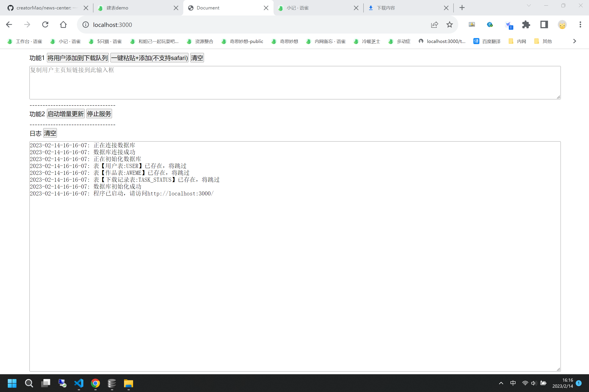
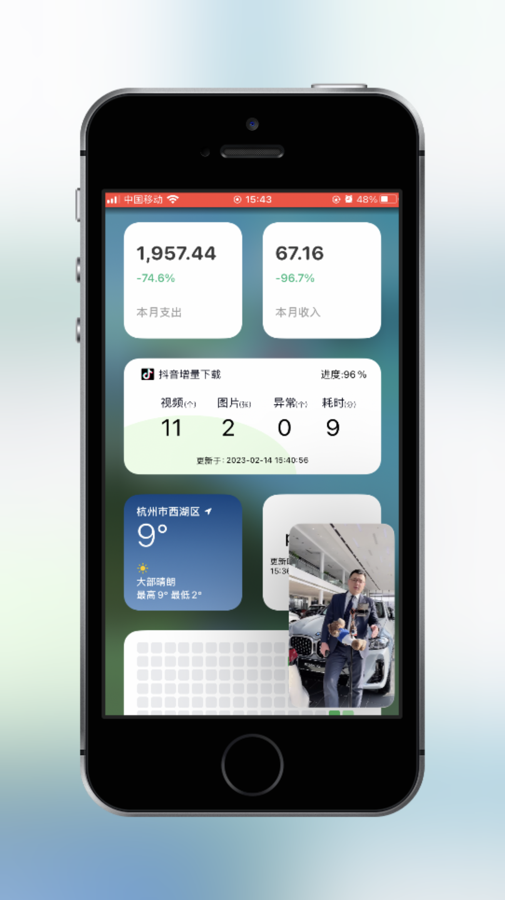

# 声明
- 本项目只做个人学习研究之用，不得用于商业用途！
- 部分逻辑与功能来自于[TikTokDownload](https://github.com/Johnserf-Seed/TikTokDownload)，请支持原作者项目。
  原作者项目语言为python，本项目语言为Nodejs

# 安装所需库

```
npm install
```

# 使用

## 1. 启动程序

```
npm run start
```

## 2. 访问站点http://localhost:3000

</img>


# 接口
## 获取最新一条下载状态信息
程序启动后，可使用下面的接口，获取最新的下载状态信息。
```
http://localhost:3000/task/status/latest

{
  "state":"ok",
  "msg":"",
  "data":{
    "ID":"50551922-f614-ecb7-2ef8-250227123c80","TASK_ID":"8fcbce0a-955e-7da4-a3e9-943294993196",
    "PHOTO_COUNT":4, 
    "VIDEO_COUNT":28,
    "DOWNLOAD_TIME_COST":742, //秒
    "TOTAL":52, //用户个数
    "CURRENT":52, //当前下载的用户
    "PROGRESS":"1.00", //下载进度=CURRENT/TOTAL
    "PHOTO_FAIL_COUNT":0,//异常下载图片个数
    "VIDEO_FAIL_COUNT":0,//异常视频图片个数
    "FAIL_TOTAL":0, //异常下载总数=PHOTO_FAIL_COUNT+VIDEO_FAIL_COUNT
    "IMP_DATE":"2023-02-14",
    "IMP_TIME":"2023-02-14 15:44:33"
  }
}
```

您可使用此接口，实现个性化的ios小组件。

此功能非开箱即用，仅提供一点思路。

- UI demo

</img>

- 小组件自定义软件：Widgy
- [一个用于信息接收、查询的中转中心](https://github.com/creatorMao/news-center)，你可以利用此库，将下载状态信息推送到该中心，这样小组件就可以随时随地获取最新的下载状态信息。